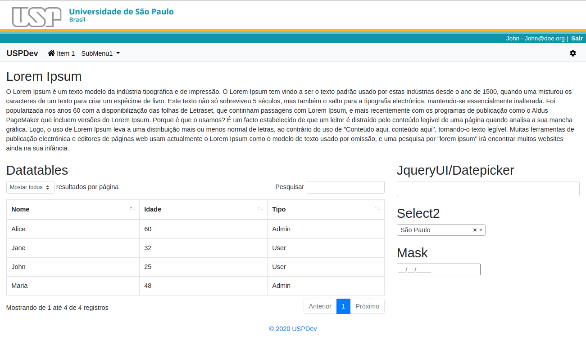

# Tema do Laravel para projetos USPdev

Desenvolver um sistema web é uma atividade que envolve diversas camadas
de complexidade e é natural termos mais habilidade ou gosto por apenas
uma ou algumas dessas camadas.
Esse pacote laravel é um template com alguns estilos da USP e
é direcionado para aqueles(as) que preferem se debruçar
no desenvolvimento do backend com laravel sem se preocupar muito
com frontend.

Evita também que fiquemos copiando código do template
de um projeto para o outro. Foi inspirado no [adminLte para laravel](https://github.com/jeroennoten/Laravel-AdminLTE)
e está aberto a contribuições e melhorias dos devs da USP.
Inicialmente desenvolvido por [@marcelomodesto](https://github.com/marcelomodesto) do IME-USP.

## Funcionalidades

Estão disponíveis no template:

- Uma barra com o logo da USP que não aparece no tamanho **sm** (mobile);
- Uma faixa com as informações de usuário/login/logout alinhado à direita;
- Uma barra de menus e sub-menus totalmente configurável;
- Possibilidade de oferecer [**link**](docs/outros-sistemas.md) para outras aplicações da Unidade;
- Personalização do tema por meio de [**skins**](docs/skins.md);
- Mensagens flash pré definidas (à partir da v2.6.0);
- Blocos (à partir da versão 2.7.0)

O tema possui as seguintes bibliotecas incorporadas:

- bootstrap (v4.6.0)
- jquery (v3.6.0)
- jqueryUI (v1.12.1)
  - datepicker, etc.
- fontawesome (v5.15.3)
- datatables (v1.10.23)
  - [responsive plugin](https://datatables.net/extensions/responsive/) (v2.2.7)
  - [HTML5 export buttons](https://datatables.net/extensions/buttons/examples/html5/simple.html) (v1.6.5)
  - [Fixed header plugin](https://datatables.net/extensions/fixedheader/) (v3.3.2)
- jquery [select2](https://github.com/select2/select2) (v4.0.13)

- jquery mask (v1.14.16)

As bibliotecas js são carregadas a partir de CDN.

## Requisitos

Este tema foi testado no Laravel 5.6.x, 7.24.x, 8.x mas deve funcionar em outras versões.

## Documentação

* [Instalação e configuração básica](docs/configuracao.md)
* [Configuração do menu](docs/opcoes-menu.md)
* [Menu ativo](docs/menu-ativo.md)
* [Link para outros sistemas](docs/outros-sistemas.md)
* [Seções](docs/secoes.md)
* [Menu dinâmico](docs/menu-dinamico.md)
* [Skins](docs/skins.md)
* [Blocos](docs/blocos.md)
* [Issues](docs/issues.md)

## Changelog

25/4/2023
- release 2.8
- removido responsive padrão do datatables (issue #114)
- modificado datatable-simples para ativar plugins por meio de classes
- removido datatable-simples-paginado, incorporado no datatable-simples

31/03/2023
- release 2.7
- incluído a opção de blocos que adicionam funcionalidades ao projeto. Ajuste o `layouts.app` da sua aplicação.

30/11/2022
- release 2.6.1
- alterado o config para expor `container` e `key => laravel-tools`. Ajuste o `config` da sua aplicação.

28/10/2022
- release 2.6.0
- [#92](https://github.com/uspdev/laravel-usp-theme/issues/92) - Incluídas mensagens flash pré definidas (desativadas por padrão no `config`) - [Treinamento Laravel](https://uspdev.github.io/laravel#31-mensagens-flash)

3/12/2021

- refatorado a documentação
- refatorado `src/UspTheme.php` - construção do menu

15/06/2021

- Incluído menu dinâmico

04/03/2021

- Incluido js e css para Datatables HTML5 export buttons

26/10/2020

- Incluido submenu divider, submenu header e alinhamento direito do submenu (#47)

28/08/2020

- Layout responsivo com suporte mobile: ajustes no menu
- Organizando js e css
- Exemplo das bibliotecas js carregadas

31/08/2020

- Acrescentado menu para outras aplicações

15/11/2020

- versão 2
- nova funcionalidade: skins
- pasta views reorganizada
- dashboard_url renomeado para app_url
